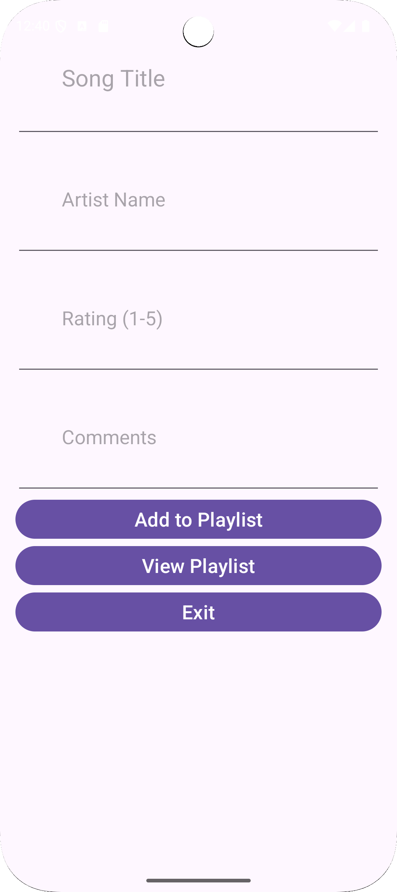
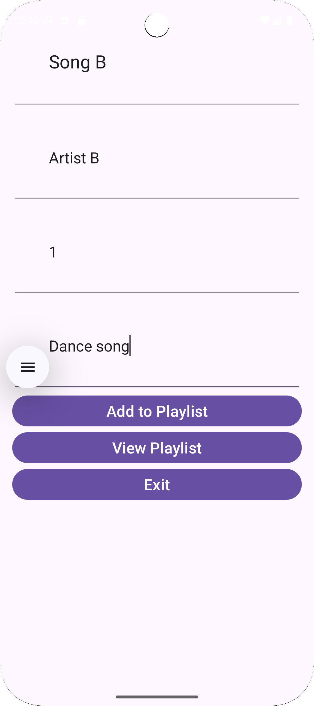
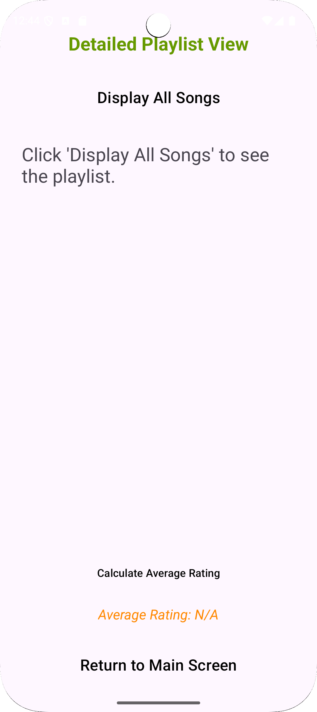
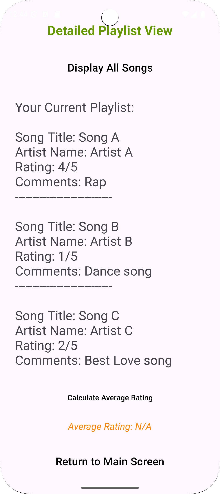

# Music-playlist

NAME: VINCENT JUNIOR KABO KOPELEDI
STUDENT NUMBER: ST10495496

Github Link: https://github.com/Vincent-UI146/Music-playlist.git

Create an Android App using kotlin using Android Studio
You have joined a team that is developing a music playlist manager app.The app stores song details and allow users to create and manage playlists. Users can rate songs, add comments, and input information about the artist.The app caters to 4 songs.

The app shows where you input your song title, Artist name, the song's rating and where you can input your comments.

This is how the user is supposed to input the song and artist information.

The second screen of the app where the user can display their playlists and how they rank their songs.

This is the second screen displaying all your songs and their ratings to their comments.
